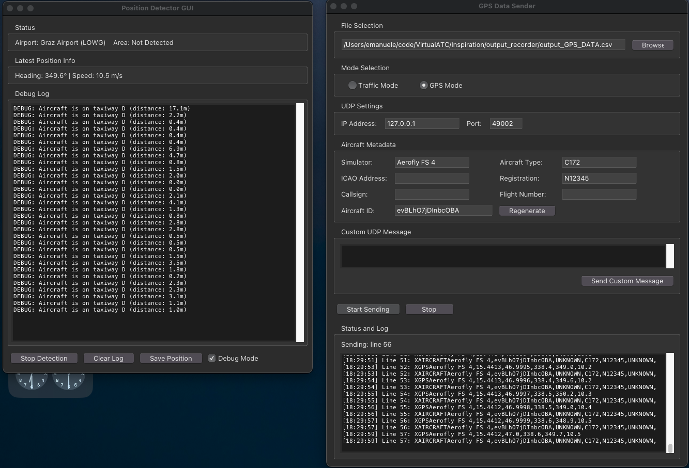
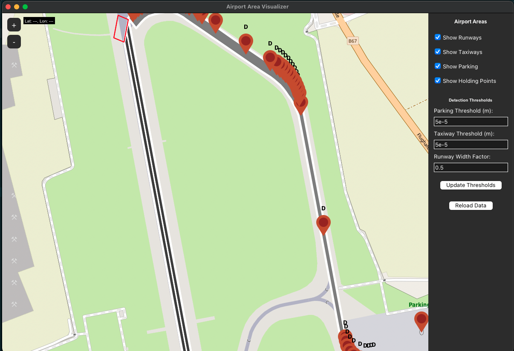

# Virtual ATC & Ground Handling for Aerofly

This project provides a foundation for simulating virtual Air Traffic Control (ATC) and realistic ground handling at airports, designed for use with Aerofly and inspired by real-world airport operations.

## Features
- **Position Detection**: Real-time detection of aircraft position on the airport (parking, taxiway, holding point, runway, in flight)
- **GUI Visualization**: Live GUI to monitor aircraft ground state and debug position detection
- **Ground Handling Concepts**: Reference documentation and data structures for modeling ground operations
- **Open for Community Expansion**: Designed for Aerofly users and the wider flight sim community to contribute and expand

## Getting Started

### Prerequisites
- Python 3.8+
- Tkinter (usually included with Python)
- Any additional dependencies listed in your environment (e.g., for UDP data, see `Inspiration/rewinger.py`)

### Running the Position Detector GUI
1. Ensure your Aerofly or simulator is sending UDP GPS/attitude data as expected.
2. Run the GUI:
   ```bash
   python position_detector_gui.py
   ```
3. The GUI will display the current detected area, location, taxiway, runway, heading, and speed.
4. Use the "Save Position" button to export the current state for debugging or sharing.

## Project Structure
- `position_detector.py` — Core logic for detecting aircraft ground state
- `position_detector_gui.py` — Tkinter GUI for live visualization and debugging
- `ground_handling_concepts.md` — Reference guide for ground handling lifecycle, ATC clearances, and data structures

## Contributing
- **Ideas Welcome!** This project is a starting point for the Aerofly community and anyone interested in airport ground operations.
- Fork the repo, open issues, or submit pull requests with improvements, new features, or documentation.
- Share your ideas and feedback on the Aerofly forum thread!

## License
Open source — feel free to use, modify, and share.

## Airport Data & Visualization

### How Airport Data Works
- Airport layouts are defined in JSON files (see `airport_data/graz_airport.json` for an example).
- Each file describes runways, taxiways (with segments), parking positions, and holding points, using real-world coordinates and properties.
- The format is designed to be easily extensible: add new airports by creating similar JSON files and updating the code to reference them.

### Visualizing Airport Zones
- Use `airport_visualizer.py` to view and debug the active airport zones (runways, taxiways, parking, holding points) on an interactive map.
- The visualizer helps you see how detection areas are defined and tune thresholds for each area type.
- Run it with:
  ```bash
  python airport_visualizer.py
  ```

### Current Status
- **Proof of Concept:** Currently, the system works only for Graz Airport (Austria), specifically taxiway D to runway 17C.
- The structure is ready for quick expansion: just add more airport data files and update references.

---

*Let's build the next generation of virtual ATC and ground handling together!* 