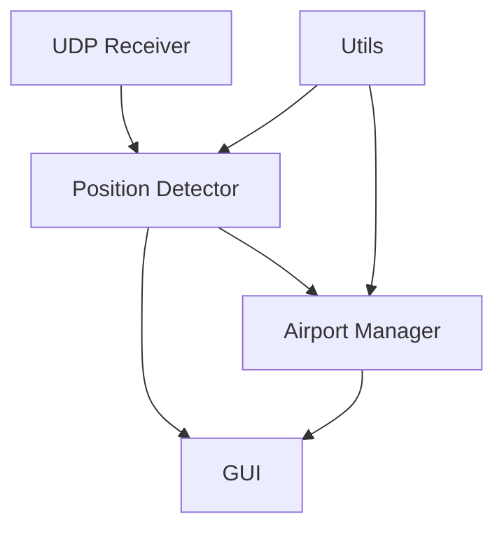

# System Architecture and Component Interactions

## Overview
The VirtualATC system is designed to simulate Air Traffic Control (ATC) operations in a single-player environment. The system consists of several key components that work together to detect aircraft positions, manage airport layouts, and provide a user interface for monitoring and control.

## Core Components

### 1. Airport Manager (`airport_manager.py`)
**Responsibilities:**
- Manages airport layout data including runways, taxiways, parking positions, and holding points
- Provides spatial queries and calculations for aircraft positioning
- Handles airport-specific operations and validations

**Key Classes:**
- `Runway`: Represents airport runways with properties like thresholds, width, and heading
- `Taxiway`: Manages taxiway segments and their connections
- `ParkingPosition`: Represents aircraft parking spots
- `HoldingPoint`: Manages holding positions for aircraft

**Interactions:**
- Used by `PositionDetector` for spatial queries
- Provides data to GUI for visualization
- Loads and manages airport layout data from JSON files

### 2. Position Detector (`position_detector.py`)
**Responsibilities:**
- Detects and classifies aircraft positions within the airport
- Processes real-time GPS and attitude data
- Determines aircraft state (parking, taxiing, on runway, etc.)

**Key Classes:**
- `PositionDetector`: Main class for position detection
- `PositionInfo`: Data structure for position information
- `AircraftArea`: Enum for different aircraft states

**Interactions:**
- Receives data from UDP receiver
- Uses `AirportManager` for spatial queries
- Provides position updates to GUI

### 3. GUI (`position_detector_gui.py`)
**Responsibilities:**
- Provides visual interface for monitoring aircraft positions
- Displays airport layout and aircraft position
- Offers controls for system operation

**Key Features:**
- Interactive map display
- Real-time position updates
- Debug information display
- Airport layout selection
- Aircraft marker visualization

**Interactions:**
- Communicates with `PositionDetector` for position updates
- Uses `AirportManager` for airport layout data
- Provides user interface for system control

### 4. Utilities (`utils/`)
**Responsibilities:**
- Provides common utility functions
- Handles geographical calculations
- Manages coordinate transformations

**Key Components:**
- `geo_utils.py`: Geographical calculations and transformations

## Data Flow

1. **Data Acquisition:**
   - UDP receiver captures real-time GPS and attitude data
   - Data is processed by `PositionDetector`

2. **Position Processing:**
   - `PositionDetector` uses `AirportManager` to determine aircraft location
   - Position is classified into specific areas (runway, taxiway, etc.)
   - Position information is formatted for display

3. **Visualization:**
   - GUI receives position updates
   - Updates map display and aircraft marker
   - Shows debug information

## Component Dependencies



## Key Interactions

1. **Position Detection:**
   - `PositionDetector` receives GPS data
   - Queries `AirportManager` for spatial information
   - Determines aircraft state and location
   - Updates GUI with position information

2. **Airport Management:**
   - `AirportManager` loads and processes airport layout
   - Provides spatial queries for position detection
   - Supplies layout data for GUI visualization

3. **User Interface:**
   - GUI displays real-time position updates
   - Shows airport layout and aircraft position
   - Provides controls for system operation
   - Displays debug information

## Error Handling

- Each component implements its own error handling
- Logging system captures errors and debug information
- GUI provides user feedback for errors
- Position detection includes fallback mechanisms

## Future Extensions

1. **ATC Communication:**
   - Integration of ATC communication patterns
   - Voice recognition and synthesis
   - Standard phraseology implementation

2. **Enhanced Visualization:**
   - 3D airport visualization
   - Traffic pattern display
   - Weather information integration

3. **Advanced Features:**
   - Multiple aircraft tracking
   - Conflict detection
   - Automated ATC instructions

# Implementation Concepts

## 1. Basic Radio Interface

### Visual Components
1. **Radio Panel (Top Section)**
   ```
   [ACTIVE: 118.700] [STBY: 121.500]
   [↑] [↓] [SWAP] [ENT]
   ```
   - Active frequency display (large, prominent)
   - Standby frequency display
   - Up/Down buttons for frequency adjustment
   - Swap button to exchange active/standby
   - Enter button to confirm frequency

2. **Communication Window (Main Section)**
   ```
   ATC: Delta 123, taxi to Runway 22L via Alpha, Bravo
   [Taxi to Runway 22L via Alpha, Bravo, Delta 123]
   [Unable, standby]
   ```
   - ATC messages appear in one color/style
   - Pre-defined response buttons
   - Quick action buttons (Unable, Standby)
   - Message history scrollable

3. **Status Bar (Bottom Section)**
   ```
   Current: Ground | Next: Tower (118.700) | Pending: Taxi Clearance
   ```
   - Current controller
   - Next expected frequency
   - Pending clearances/actions

## 2. Communication Flow

### Basic Interaction
1. **Incoming Message**
   - ATC message appears in chat window
   - Relevant response buttons appear
   - Status updates if needed

2. **User Response**
   - Click pre-defined response
   - Or use quick action button
   - Response appears in chat
   - System processes next action

3. **System Response**
   - Updates status if needed
   - Changes frequency if required
   - Provides next message/clearance

### Example Scenario
```
ATC: Delta 123, contact Tower 118.700
[Contacting Tower 118.700, Delta 123]
[Unable, standby]

User clicks "Contacting Tower 118.700, Delta 123"
System automatically:
- Changes frequency to 118.700
- Updates status to "Current: Tower"
- Provides next message
```

## 3. Implementation Modes

### Simple Mode (Default)
- Pre-defined responses only
- Automatic frequency management
- Guided handoff procedures
- Basic status tracking

### Advanced Mode
- Custom message input
- Manual frequency control
- Full clearance responsibility
- Detailed status tracking

## 4. Technical Components

### Core Features
1. **Frequency Management**
   - Active/standby frequency display
   - Frequency input validation
   - Automatic frequency changes
   - Frequency presets

2. **Message System**
   - Pre-defined message templates
   - Quick action responses
   - Message history
   - Clearance tracking

3. **State Management**
   - Current controller tracking
   - Pending clearances
   - Next expected frequency
   - Handoff coordination

### User Experience
- Simple, intuitive interface
- Clear visual feedback
- Minimal user input required
- Progressive learning curve

## 5. Example Scenarios

### Ground to Tower Handoff
```
ATC: Delta 123, contact Tower 118.700
[Contacting Tower 118.700, Delta 123]
[Unable, standby]

User clicks response
System changes frequency
New ATC message appears
```

### Taxi Clearance
```
ATC: Delta 123, taxi to Runway 22L via Alpha, Bravo
[Taxi to Runway 22L via Alpha, Bravo, Delta 123]
[Unable, standby]

User clicks response
System updates taxi clearance status
```

### Holding Pattern
```
ATC: Delta 123, hold position
[Holding position, Delta 123]
[Unable, standby]

User clicks response
System updates aircraft state
```

## 6. Full-Screen Integration Strategies

### Option 1: Overlay Window
```
[Game Screen]
+------------------+
|                  |
|     [ATC UI]     |
|  [Floating here] |
|                  |
+------------------+
```
- Floating window that stays on top
- Can be moved/resized
- Semi-transparent background
- Always visible over game
- Pros:
  - Always accessible
  - Can be positioned anywhere
  - Doesn't interfere with game view
- Cons:
  - May block game view
  - Requires window management
  - Potential performance impact

### Option 2: Side Panel
```
[Game Screen]
+------------------+-----------+
|                  |           |
|                  |  [ATC UI] |
|                  |           |
|                  |           |
+------------------+-----------+
```
- Fixed position on screen edge
- Collapsible/expandable
- Can be toggled on/off
- Pros:
  - Consistent position
  - Doesn't block main view
  - Easy to access
- Cons:
  - Takes up screen space
  - May not work with all aspect ratios
  - Less flexible positioning

### Option 3: Hotkey-Activated
- Hidden by default
- Appears on hotkey press
- Auto-hides after use
- Pros:
  - Maximizes screen space
  - Clean interface
  - No permanent overlay
- Cons:
  - Requires memorizing hotkeys
  - May miss messages
  - Less immediate access

### Option 4: Game Integration
- Built into game HUD
- Part of cockpit interface
- Integrated with existing displays
- Pros:
  - Seamless experience
  - No separate window
  - Consistent with game
- Cons:
  - Requires game modification
  - Less flexible
  - May conflict with other HUD elements

## 7. UI Placement Recommendations

### Primary Considerations
1. **Visibility**
   - Must not block critical game elements
   - Should be easily readable
   - Important information always visible

2. **Accessibility**
   - Easy to reach controls
   - Quick response capability
   - Minimal interference with flying

3. **Customization**
   - Allow user to choose position
   - Adjustable transparency
   - Resizable interface

### Suggested Default Layout
```
Top-Right Corner (Default)
+------------------+
| Game Screen      |
|              [UI]|
|                  |
+------------------+

Alternative: Bottom-Left
+------------------+
| Game Screen      |
|                  |
|[UI]              |
+------------------+
```

### Implementation Notes
- Use system-level window management
- Support multiple monitor setups
- Allow saving preferred positions
- Provide quick position presets
- Include minimize/maximize options 